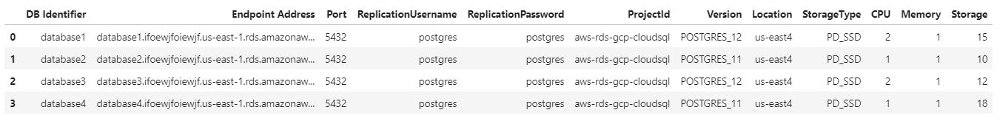

# Migration RDS to CloudSql

This code automatize the process of migrate several aws rds instances to gcp cloudsql. 

From a CSV file it generates, by each row, a migration job in gcp dms to create a cloud sql instance and create a cdc process to migrate data from rds.

Parameter input: "migration_file.csv"



## Installation

```bash
pipenv install
```

## Usage

### migrate

```bash
python pg_migration/migrationfile_reader.py --migration-file "migration_file.csv"
```

#### Optional arguments

##### Parameter �-migration-file

Indicates the file name where there are the credentials of rds instances.

### get status

```bash
python pg_migration/pickles_reader.py
```

### validate migration

```bash
python pg_migration/postmigration_validation.py
```

## License

[MIT](https://choosealicense.com/licenses/mit/)